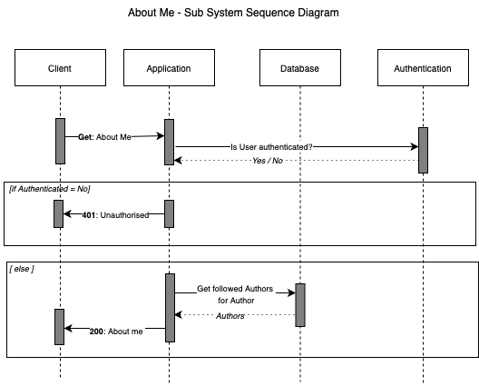
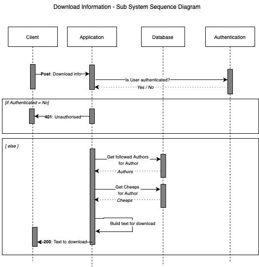

# Design and Architecture of _Chirp!_


## Domain model

<!-- -->


> Illustration of the Domain model of _Chirp!_ application. Data Transfer Objects are used to minimize data transfer calls. IChirpService handles data proccessing between DBContext and author / cheep repositories and entities, request from layers above. IDBContext is used to handle Database control and querying. 


## Architecture — In the small


<!--  -->

> On the above diagram we display the onion-like architecture that is employed within the application. Classes located in any circle are dependant on the classes in the circles closer to the middle. The outer layers are closer to what the user interacts with while the inner circles are the core functionalities of _Chirp!_.


## Architecture of deployed application


<!--  -->

**Configuration**

Chirp! is configurable for target environments developement and production through dedicated appsettings.<Development | Production>.json.

**Azure web services**  

The _Chirp!_ client is hosted as an Azure Web Service, and connects to database through appsettings connection string for either SqLite or SqlServer.

**Database**  

The deployed application supports using both SQLite and Azure SQL database based on the configurations in appsettings.Production.json. In the deployed application, the appsettings configuration for SQLite is chosen in the final deployed application, due to insufficient student credits, at the end of the project.

When Chirp! is configured to use SqLite, the SqLite database file is stored on Azure Web Service server.

However, Chirp! is fully capable to run on SqlServer without any alterations other than appsettings configurations.

## User activities


<!--  -->

> The above diagram shows a user journey scenario (a typical way to traverse the _Chirp!_ application). We show the options of pages and actions aswell as conditionals. 


## Sequence of functionality/calls through _Chirp!_

The following sub-system sequence diagrams, illustrates the interaction between high level sub-systems and uses the following definitions.

- Public - Page showing public timeline with cheeps from any Authors. Accessible for Unauthorized- and auhtorized users.
- Private - Page showing private timeline with cheeps for a specifc Author. Accessible for Unauthorized- and auhtorized users.
- My Timeline - Page showing private timeline with cheeps for a authenticated Author and followed Authors. Accessible for auhtorized users.
- Authors - Page showing searchable Authors. Accessible for Unauthorized- and auhtorized users.
- About me - Page showing authenticated Author information and followed Authors for authenticated Author. Download Information and Forget Me feature are accessible from this page. Accessible for Unauthorized- and auhtorized users.

**Public Timeline**


<!--  -->
> The sequence diagram of interactions between subsystems through _Chirp!_ on Public Timeline. 

**Private Timeline**


<!--  -->
> The sequence diagram of interactions between subsystems through _Chirp!_ on Private Timeline. 

**My Timeline**


<!--  -->
> The sequence diagram of interactions between subsystems through Chirp! on My Timeline. 

**Authors**


<!--  -->
> The sequence diagram of interactions between subsystems through _Chirp!_ on Authors. 

**About Me**


<!--  -->
> The sequence diagram of interactions between subsystems through _Chirp!_ on About Me.

**Share Cheep**


<!---->
> The sequence diagram of interactions between subsystems through _Chirp!_ for the Share Cheep feature. 

**Follow Author**


<!-- -->
> The sequence diagram of interactions between subsystems through _Chirp!_ for the Follow feature. 

**Unfollow Author**


<!-- -->
> The sequence diagram of interactions between subsystems through _Chirp!_ for the Unfollow feature. 

**Forget Me**


<!--  -->
> The sequence diagram of interactions between subsystems through _Chirp!_ for the Forget Me feature. 

**Download Information**


<!--  -->
> The sequence diagram of interactions between subsystems through _Chirp!_ for the Download Information feature. 

# Process

## Build, test, release, and deployment


<!--  -->
In order to automate the majority of the development process, the deployment and release workflows are automated using GitHub Actions workflows. 

The _Release_ workflow first builds and tests the application, to minimise the risk of errors and bugs in the application to be released. If the build is succeeded and the tests are passed, the workflow will create a new release on github with a dependent, ready-to-run-application with the given semantic version tag “vx.x.x”. The release workflow is triggered by pushing a new tag to the main branch.

The _Deployment_ workflow also builds and tests the application as the first step. If the first step is succeeded, the workflow will the deploy the application to Azure.
The deployment workflow is triggered on any push or merge to main, which means that the newest work that has been made to the made branch will be available on the web application.


## Teamwork

When an issue is created, a ticket is generated and put into the "New" section of the project board with the tag "Triage" assigned to it. From here it will be moved into either "Backlog" for tickets that cannot be done immediately and "ready" for tickets that are ready to be taken on by a group member. When working on a ticket one should be assigned to it and move it to the "In Progress" section. Once a pull request has been created the ticket should be "In Review" and then moved to "Done" once the issue is resolved. 


<!--  -->

> Illustration of a ticket moving through the projectboard. From a new issue to pull request.

## How to make _Chirp!_ work locally

As _Chirp!_ supports using both SQLite and SQLServer in both development- and production environment, Chirp can be configured to a specific database provider through appsettings. For local SqlServer this guide uses Docker to host SqlServer instance.

**For Local SqLite**
- Set "DatabaseProviderType" for "DatabaseProviderConfig" in appsettings.json - to "SqLite".
- Open Terminal
- ```cd <Chirp>/src/Chirp.Web```
- ```dotnet run``` 

**For Local SqServer**
- Set "DatabaseProviderType" for "DatabaseProviderConfig" in appsettings.json - to "SqlServer".
- Open Terminal
- Start docker
- [MacOS] ```docker run --cap-add SYS_PTRACE -e 'ACCEPT_EULA=1' -e 'MSSQL_SA_PASSWORD=adminAdmin!' -p 1433:1433 --name ChirpDockerDB -d mcr.microsoft.com/azure-sql-edge```
- [Windows] ```docker run -e "ACCEPT_EULA=Y" -e "MSSQL_SA_PASSWORD=adminAdmin!" -p 1433:1433 -name ChirpDockerDB -d mcr.microsoft.com/mssql/server:latest```
- ```cd <Chirp>/src/Chirp.Migrations```
- [MacOS] ```export ASPNETCORE_ENVIRONMENT=Development```
- [Windows] ```set ASPNETCORE_ENVIRONMENT=Development```
- ```dotnet ef database update```
- ```dotnet run seed```
- ```cd <Chirp>/src/Chirp.Web```
- ```dotnet run```

## How to run test suite locally

_Chirp!_ covers several test strategies - unit tests, integration tests and End2End tests.

**Steps to run Unit Tests**
- Open Terminal
- ```cd <Chirp>/test/Chirp.Infrastructure.Test"```
- ```dotnet test```
- - ```cd <Chirp>/test/Chirp.Web.Test"```
- ```dotnet test```

**Steps to run Integration Tests**
- Open Terminal
- ```cd <Chirp>/test/Chirp.IntegrationTests"```
- ```dotnet test```
  
**Steps to run End2End Tests**
- Open Terminal
- ```cd <Chirp>/test/Chirp.End2EndTests"```
- ```dotnet test```

# Ethics

## License
We have chosen to make use of the MIT license for th _Chirp!_ application. This is done as we appreciate our work being available to others. If anyone would want to continue working on the project or make use of specific parts we would encourage this. Besides this, we appreciate that the MIT license is meant to be as easy to understand as possible, so usage of MIT licensed software is as approachable as possible. With these ideals, one could argue that we should choose a FOSS License to ensure that work based on ours will also be open source, but we feel that this would overcomplicate the matter. Seen in a broader perspective this application is rather small in scale and with our resources being allocated to studies it is unrealistic that we would enforce a FOSS license.

## LLMs, ChatGPT, CoPilot, and others
Throughout the project LLM usage has been kept to a minimum, only used to ask quick questions about syntax for either C# code og advice for how to set up 3rd party tools such as Azure and Docker.

Towards the end, however, when finishing the test suite, a lot of different libraries were used and ChatGPT was a great help to understand the basics and provide tips for how to fetch certain necessary components using different methods for separate elements. Here, the use of ChatGPT was used in a way to gain quick and easy access to information, instead of having to learn whole libraries one could ask for very specific guidance. Using the tool this way greatly sped up the deployment of tests as the responses were clear and helpful, and gathering the knowledge ourselves would have taken longer.

A small side note is that specifically ChatGPT is not 100% up-to-date and will sometimes give vague or misleading answers with solutions that are outdated. However, these outdated answers were used to guide us towards the correct answers and implementations.

